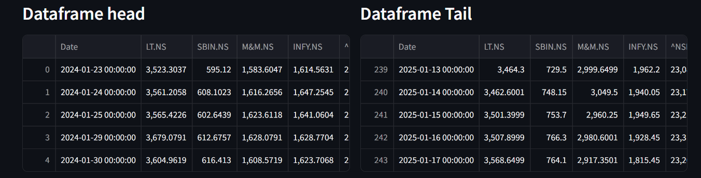
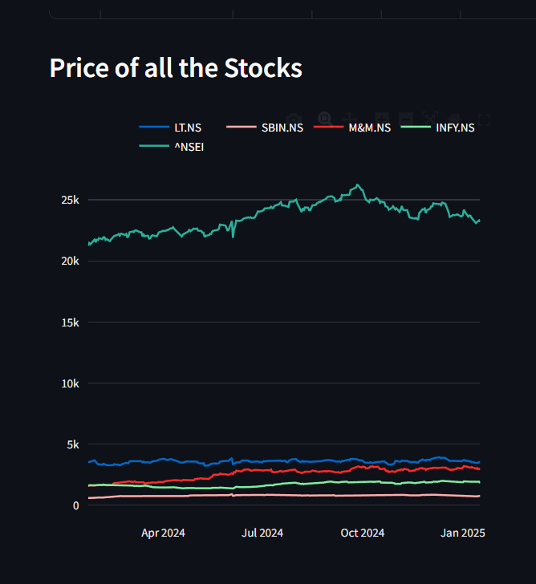
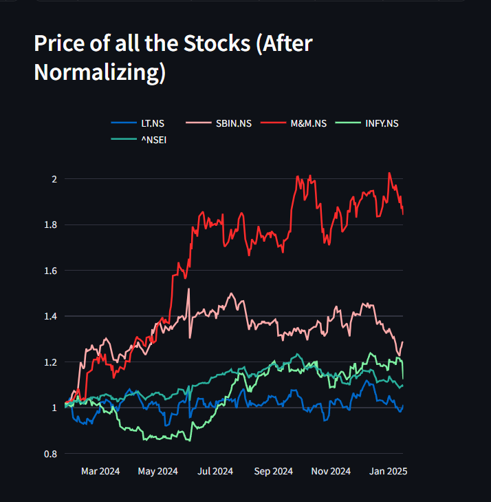

# Stock-Performance-Analytics-CAPM-and-CAGR-Dashboards
This project demonstrates the calculation and visualization of Capital Asset Pricing Model (CAPM) and Compound Annual Growth Rate (CAGR) for stocks selected by users. The application combines Python, Streamlit, and Power BI to provide an end-to-end data analysis and visualization pipeline. Users can interact with the dashboards to understand stock performance, risk, and return over time.

## Features

### CAPM Calculation and Analysis | Python (Pandas, yfinance, streamlit)

1) **User Stock Selection**:
   * Users can select stocks from a multiselect dropdown list.
   * Input the desired number of years for historical data analysis.
    

     

2) **Data Visualization**:
   * A dataframe is created showcasing the daily closing prices of selected stocks.
     
     

3) **Graphs**:
   * Stock Close Prices: Line chart of the closing prices for all selected stocks.
  
     

4) **Normalized Data**:
    * Line chart of normalized closing prices for better comparison.
  
      

5) **Calculations**:
   * Daily returns for each stock.
   * Beta values for selected stocks.
   * CAPM returns.

### CAGR Calculation and Analysis | Python (Pandas, yfinance, streamlit)

1) **Long-Term Analysis**:
   * CAGR calculated using 17 years of historical data.
   * Adjustments for stock bonuses and splits.

#### Output:
* A downloadable CSV containing Beta, CAPM returns, and CAGR values for all selected stocks.

  
### Data Cleaning and Integration | Excel

* The exported CSV was cleaned and merged in **Excel** to consolidate all tables.
* Added a Category column based on the beta values for enhanced analysis.

### Dashboards-Analysis | PowerBI

1) **CAPM - Risk vs. Return Analysis**:
   * Visualizing the tradeoff between risk and return for selected stocks.

2) **CAGR Analysis**:
   * Insights into the long-term performance of selected stocks.

3) **Combined Analysis**:
   * A comprehensive view of both CAPM and CAGR metrics.

