# Stock-Performance-Analytics-CAPM-and-CAGR-Dashboards
This project demonstrates the calculation and visualization of Capital Asset Pricing Model (CAPM) and Compound Annual Growth Rate (CAGR) for stocks selected by users. The application combines Python, Streamlit, and Power BI to provide an end-to-end data analysis and visualization pipeline. Users can interact with the dashboards to understand stock performance, risk, and return over time.

---

## Features

### CAPM Calculation and Analysis | Python (Pandas, yfinance, streamlit)

1) **User Stock Selection**:
   * Users can select stocks from a multiselect dropdown list.
   * Input the desired number of years for historical data analysis.
    

     

2) **Data Visualization**:
   * A dataframe is created showcasing the daily closing prices of selected stocks.
     
     

3) **Graphs**:
   * Stock Close Prices: Line chart of the closing prices for all selected stocks.
  
     

4) **Normalized Data**:
    * Line chart of normalized closing prices for better comparison.
  
      

5) **Calculations**:
   * Daily returns for each stock.
     
   * Beta values for selected stocks.
     
      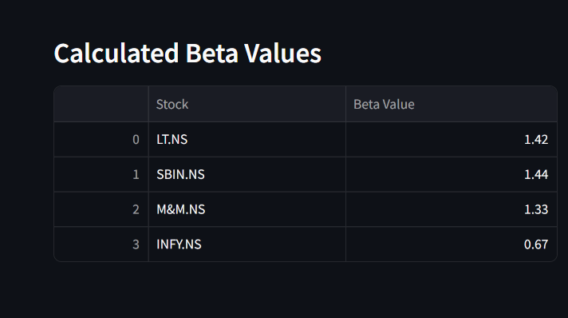  
      
   * CAPM returns.
     
      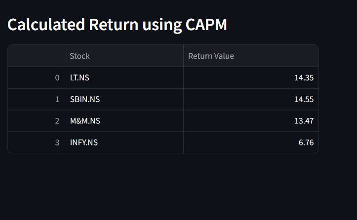

---

### CAGR Calculation and Analysis | Python (Pandas, yfinance, streamlit)

1) **Long-Term Analysis**:
   * CAGR calculated using 17 years of historical data.
   * Adjustments for stock bonuses and splits.
  
     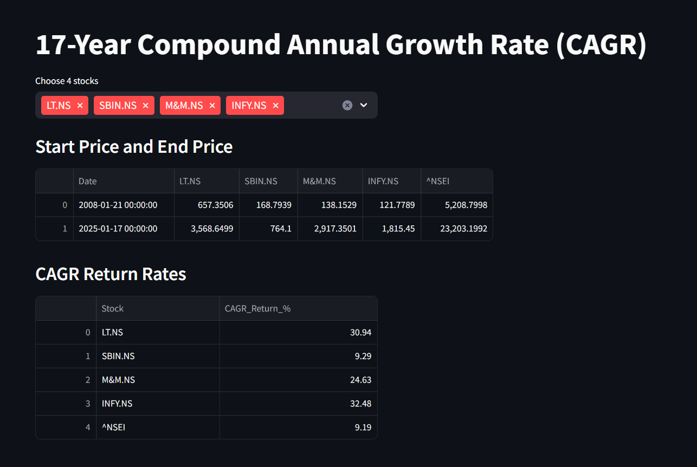

#### Output:
* A downloadable CSV containing Beta, CAPM returns, and CAGR values for all selected stocks.

---
  
### Data Cleaning and Integration | Excel

* The exported CSV was cleaned and merged in **Excel** to consolidate all tables.
* Added a Category column based on the beta values for enhanced analysis.

  ---

### Dashboards-Analysis | PowerBI

1) **CAPM - Risk vs. Return Analysis**:
   * Visualizing the tradeoff between risk and return for selected stocks.
  
     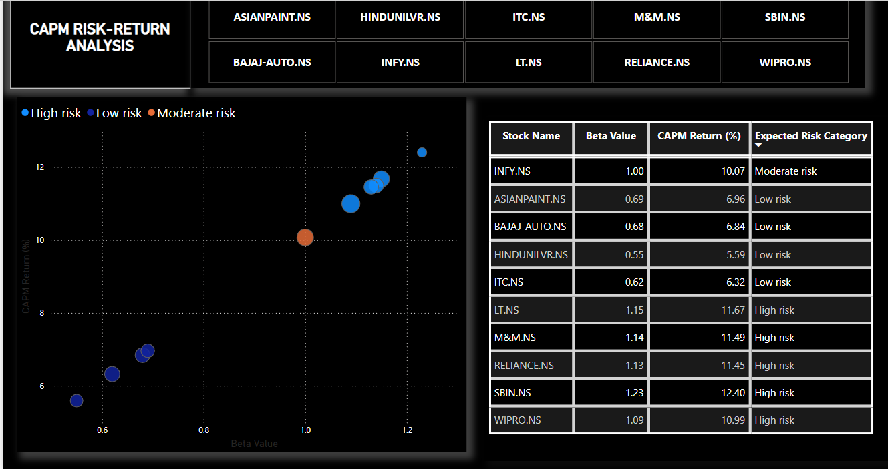

2) **CAGR Analysis**:
   * Insights into the long-term performance of selected stocks.
  
     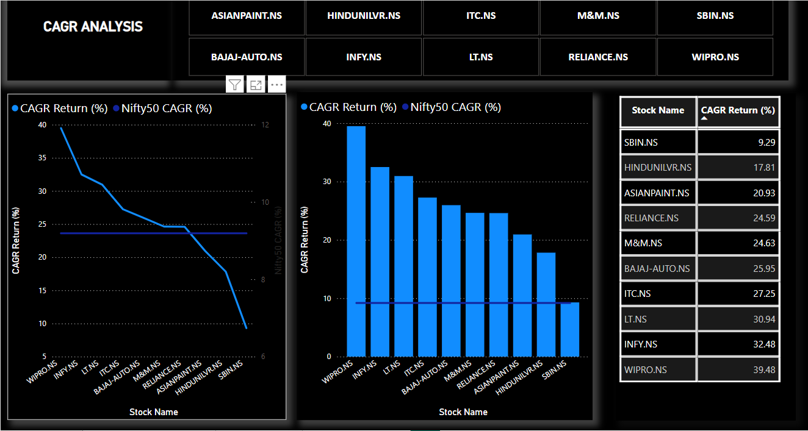

3) **Combined Analysis**:
   * A comprehensive view of both CAPM and CAGR metrics.
  
     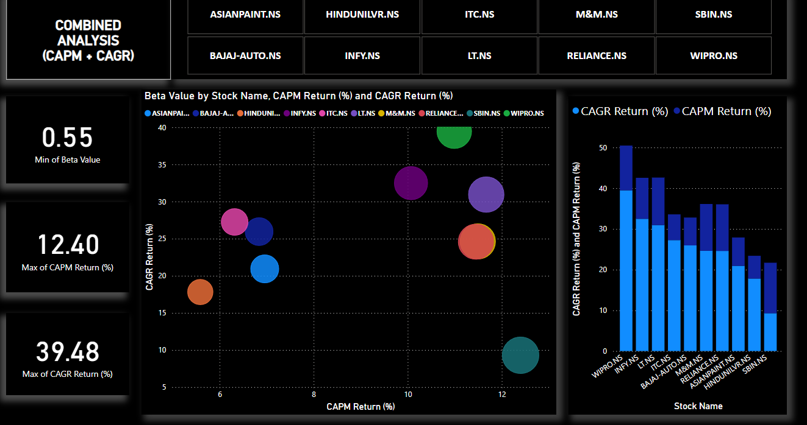

  ## Use Case: Stock Analysis for Person A

  ### The Problem
#### **Person A had two main challenges:**

1) Understanding Risk vs. Return: How to evaluate whether a high-risk stock was worth the potential reward.
2) Long-Term Growth: Identifying stocks that outperformed the market in the long run.

* They needed a tool that could break down complex metrics into simple, actionable insights. That’s where this project came in.

 ## The Analysis
 
**Step 1: Stock Selection**
- Person A selected two stocks for analysis:

1) WIPRO.NS: A prominent IT company with a history of growth.
   
2) SBIN.NS: A leading bank but with mixed performance metrics.

   

 **Step 2: Data Visualization**
- The app displayed:

1) The daily closing prices for both stocks over the last 3 years.

2) Normalized price trends, making it easier to compare their performance.

- We can't conculde anything from the normalized price trends, as wipro released a bonus share [1:1] in Dec, 2024. Bonus is not handled in the CAPM model. So, we'll analyse the CAGR trend, alongwith this.

---

**A. CAPM Analysis**

1) WIPRO had a Beta of 1.09 and a CAPM return of 10.99%, indicating it was relatively aligned with market movements but offered high potential returns.
2) SBIN had a Beta of 1.23 and a CAPM return of 12.40%, suggesting high risk but little reward.
   
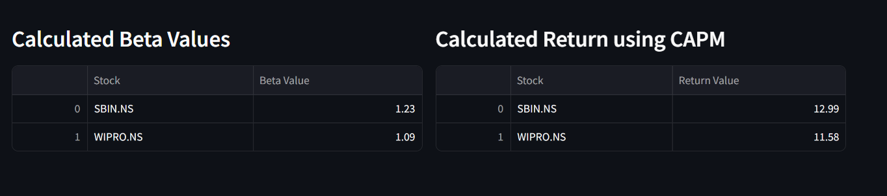

**B. CAGR Analysis**
Using 17 years of historical data, the app calculated:

1) WIPRO’s CAGR: A staggering 39.48%, far exceeding the NSEI CAGR (9.19%).
2) SBIN’s CAGR: A modest 9.29%, just barely beating the market benchmark.

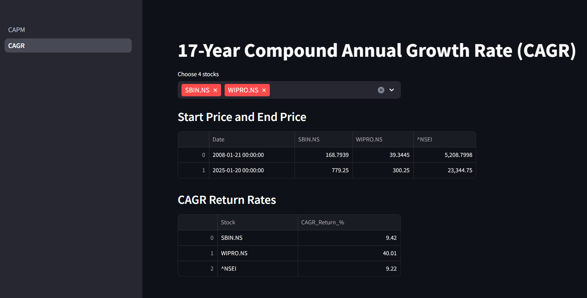

### The Insight
- Through the analysis:

1) Person A realized that WIPRO.NS offered both high returns and manageable risk, making it a strong long-term investment.
2) On the other hand, SBIN.NS posed a high risk without sufficient reward, leading Person A to reconsider their investment.
   
### The Outcome
- With the insights gained, Person A downloaded the consolidated CSV and explored the Power BI dashboards for advanced insights:

1) CAPM Risk vs. Return Dashboard: Visualized the tradeoff between risk and reward.
  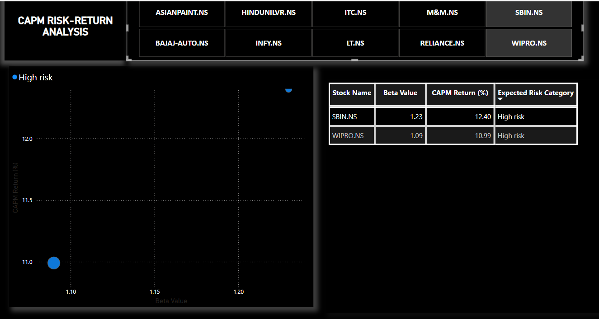
   
3) CAGR Dashboard: Highlighted long-term growth potential.
   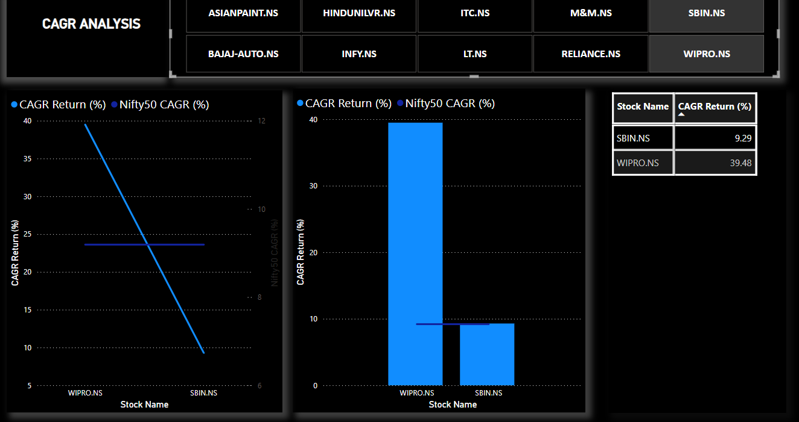
  
5) Combined Dashboard: Provided a holistic view of both metrics.
   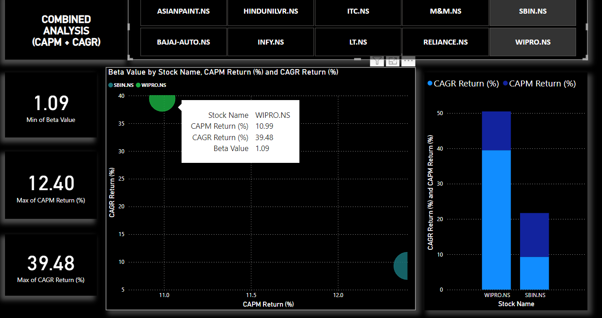

---

## The Impact
- By leveraging this tool, Person A:

1) Made smarter investment choices by prioritizing high-return stocks with manageable risk.
2) Avoided potential losses by identifying underperforming high-risk stocks.
3) Gained confidence in their investment strategy with data-backed insights.

   

